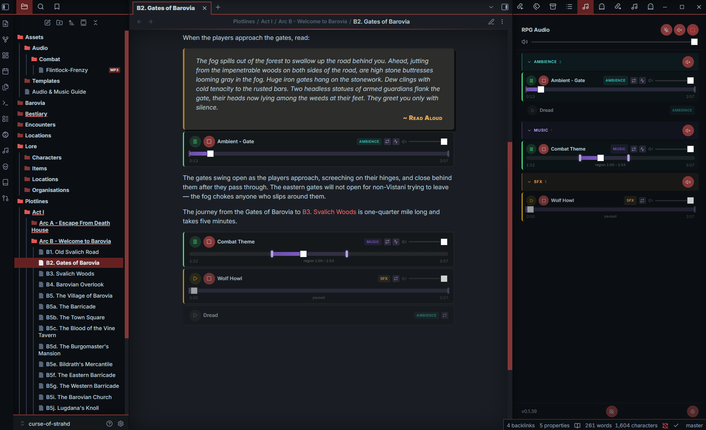

# RPG Audio

Turn your session prep notes into a soundboard — ambience, music, and sound effects, all controlled from within Obsidian.



## Features

- **Inline players** — add `rpg-audio` code blocks to any note and get play/pause, stop, volume, loop toggle, and a seek bar right next to your encounter text
- **Seek bar with region handles** — scrub to any position; drag the start/end handles to set a playback region on the fly (the region is highlighted on the bar and loops independently of the rest of the file)
- **Sidebar** — a dedicated panel showing all tracks grouped by type with colour-coded section headers, per-track seek bar, and global/per-group fade controls
- **Scene transitions via `scope:`** — label tracks with one or more context tags; playing a scoped track automatically stops tracks from other scopes
- **Crossfade** — exclusive transitions fade smoothly (configurable duration, or instant)
- **Playlists** — list multiple files and they play in sequence, with optional looping
- **Layered audio** — run ambience, music, and sound effects simultaneously with independent volume controls
- **Per-player volume fades** — start an inline player at one volume and move linearly to another over a configured number of seconds
- **Fade controls** — fade in/out individual groups (e.g. fade out all ambience) or everything at once, with red/green direction feedback while volume changes
- **Visible configuration errors** — invalid settings and missing audio files replace the player with a red error panel that identifies each problem
- **Autoplay** — mark tracks with `autoplay: true` and they start playing as soon as their note opens or is shown in a hover popover. Gated by a sidebar toggle so prep stays silent and you only flip it on at the start of a session
- **Audio block editor** — add or safely edit single-file and playlist blocks through a validated GUI without remembering the syntax
- **Debug overlay** — optional sidebar toggle that shows each track's last event and the active scope set, useful when audio behaves unexpectedly

## Use cases

- **GMs who prep in Obsidian** — embed audio controls right next to your encounter notes. When the party enters the tavern, hit play without alt-tabbing.
- **Layered soundscapes** — run rain ambience, tavern chatter, and a bard's tune simultaneously, each with its own volume.
- **Scene-based audio** — tag tracks by location or context with `scope:`. Switching scenes is a single click and the previous scene's audio steps aside automatically.
- **Solo RPG / journaling** — set the mood for your solo sessions.

## Quick start

1. Create an `audio/` folder in your vault and drop some `.mp3` files in it
2. Add this to any note:

````markdown
```rpg-audio
id: tavern
name: Tavern Ambience
loop: true
file: audio/tavern.mp3
```
````

3. Switch to reading mode — hit play

You can also run **Add audio block**, or use the editor context menu, to choose local files and configure the block visually. Use the emoji button beside **Name** to browse more than 1,900 Unicode 17 emojis by category or search case-insensitively by CLDR name and keywords such as `music`, `sword`, or `rain`. The picker includes an RPG-focused category with additional tabletop aliases and a vault-specific **Recently used** list. Emoji data is bundled with the plugin, so browsing and search work offline and never contact an emoji service. Selecting an emoji inserts it at the current caret without replacing the existing name, and the picker stays open for rapid repeated insertion. Use arrow keys, Home, End, Enter, and Space to navigate; Escape clears an active search first and then closes the picker, which also closes when selecting outside it. The audio picker groups matching files into labeled, collapsible vault-folder sections, including nested categories such as `Music/Combat`, while retaining search and multi-selection. Select a folder heading, or focus it and press Enter or Space, to expand or collapse its files. When the cursor is inside an existing block, run **Edit audio block**. Rendered players expose the same edit action from their More actions menu.

The block type selector uses the established color for each built-in type. Select **Custom…** to enter a reusable type name and choose its color. Saving the block also saves that custom type globally, so it returns as a colored selector option after reopening Obsidian and can be selected as the default for new blocks under **Settings → RPG Audio → Code block defaults**.

The editor automatically changes from Single file to Playlist when a second file is selected. Playlist-only settings are retained while the editor remains open but are omitted if the block is saved with one file. Missing files, duplicate IDs, invalid timestamps, unsafe source syntax, and stale-source conflicts block saving instead of overwriting data.

## Common patterns

### A single looping track

````markdown
```rpg-audio
id: rain
name: Rain
type: ambience
loop: true
file: audio/ambience/rain.mp3
```
````

### A layered scene (music + ambience + sfx)

Define multiple tracks in the same note. They share controls but play independently, each with its own volume.

````markdown
```rpg-audio
id: tavern-music
name: Tavern Music
type: music
loop: true
file: audio/music/tavern.mp3
```

```rpg-audio
id: tavern-chatter
name: Tavern Chatter
type: ambience
loop: true
file: audio/ambience/tavern-chatter.mp3
```

```rpg-audio
id: door-creak
name: Door Creak
type: sfx
file: audio/sfx/door-creak.mp3
```
````

### Fade a track to a background level

Set an initial `volume`, then provide both volume-fade fields. This example starts at full volume and fades linearly to half volume over 60 seconds:

````markdown
```rpg-audio
id: scene-intro
name: Scene intro
type: music
loop: true
volume: 1.0
volume-fade-to: 0.5
volume-fade-duration: 60
file: audio/music/scene-intro.mp3
```
````

The fade starts on fresh playback. Pausing freezes it and resuming continues it for the remaining time. While volume changes, the track's volume handle slowly blinks red when decreasing or green when increasing; outside a fade it keeps its normal grey/white appearance. Moving that slider cancels the active automation so the manual value takes over. After the track stops, its next fresh play starts again at `volume` and runs a new fade.

### Scene transitions with `scope:`

`scope:` is a comma-separated list of context labels (any strings you choose). When a scoped track starts playing, the engine sets the **active scope** to that track's labels and stops any other playing track whose scope isn't a subset of the new active set. Tracks with the same scope coexist; tracks without a `scope:` are unaffected by transitions.

````markdown
```rpg-audio
id: tavern-music
name: Tavern Music
type: music
scope: tavern
loop: true
file: audio/music/tavern.mp3
```

```rpg-audio
id: tavern-amb
name: Tavern Ambience
type: ambience
scope: tavern
loop: true
file: audio/ambience/tavern-chatter.mp3
```

```rpg-audio
id: forest-music
name: Forest Music
type: music
scope: forest
loop: true
file: audio/music/forest.mp3
```
````

Starting `tavern-music` plays alongside `tavern-amb` (same scope). When you later trigger `forest-music`, both tavern tracks stop automatically — no per-track directives needed.

Multi-scope is supported: `scope: outdoors, district-1` means the track belongs to *both* contexts. It keeps playing as long as every label it claims is part of the active scope. So a track scoped `outdoors` survives transitions between any `outdoors, …` scopes (handy for weather beds and region-spanning atmospheres).

### Playlists

````markdown
```rpg-audio
id: battle-music
name: Battle Music
type: playlist
loop: true
start: 0:15
end: 3:00
playlist-end-action: next
crossfade: 3s
files:
- audio/music/battle-01.mp3 [Opening assault]
- audio/music/battle-02.mp3 [Enemy reinforcements] {start=0:45, end=2:20}
- audio/music/battle-03.mp3 [Last stand] {start=none, end=4:00}
```
````

Add `random: true` to shuffle. By default, `playlist-end-action: auto` preserves the original behavior: without `loop: true`, one item plays and stops; with loop enabled, playback advances and wraps. Use `playlist-end-action: next` to advance through the list even when loop is off, stopping after the last item.

Set `crossfade` to the number of seconds that adjacent items should overlap, using either `crossfade: 3` or `crossfade: 3s`. The incoming item starts at its effective start boundary while the current item fades out and the incoming item fades in. Automatic crossfades occur only when the end action advances to another item; `repeat` and `stop` keep their literal behavior. Selecting another item while playback is active also uses the crossfade. If less time remains than configured, the overlap is shortened to the available time. Pausing or stopping during a crossfade safely ends the outgoing source.

Inline players with more than one file include a collapsible playlist below the transport controls. Expand it to see every file in configured order, identify the current item, or select any available item to play it immediately. The list stays in configured order when `random: true`; unavailable files are identified when permissive validation allows the player to render.

Add an optional display title after a playlist path using square brackets. The title appears in the playlist while playback and validation continue to use only the path. Entries without a title use their filename:

```yaml
files:
- audio/music/battle-01.mp3 [Opening assault]
- audio/music/battle-02.mp3 [Last stand]
- audio/music/battle-03.mp3
```

Block-level `start` and `end` values are inherited by every playlist item. Add a trailing brace block to override either boundary for one file. Omitted options inherit the block value; `none` explicitly removes that boundary:

```yaml
start: 0:15
end: 3:00
files:
- battle-01.mp3 [Uses both defaults]
- battle-02.mp3 [Custom excerpt] {start=0:30, end=2:10}
- battle-03.mp3 [Natural ending] {end=none}
```

## Sidebar

Click the music note icon in the ribbon (or run the **Toggle audio sidebar** command) to open a sidebar panel. The sidebar shows:

- **Global controls** — Fade In All, Fade Out All, and Stop All buttons; the fade control blinks red or green while affected track volume is decreasing or increasing
- **Master volume slider** — controls the global volume for all tracks
- **Tracks grouped by type** — collapsible sections colour-coded by type (purple for music, teal for ambience, amber for sfx)
- **Per-group fade controls** — fade in or fade out all tracks of a specific type, with matching direction feedback while the group changes
- **Per-track controls** — play/pause, fade out or stop, loop toggle, volume slider, and a seek bar with region handles for each track; the volume handle blinks red while decreasing and green while increasing
- **Playlist status** — current position for multi-file tracks (e.g. "Playing 2/5")
- **Debug toggle** — bug icon in the footer reveals scope labels, last-event info per track, and the active scope set

## Field reference

### Common settings

| Field   | Required | Description |
|---------|----------|-------------|
| `id`    | Yes      | Unique identifier for the track. Used internally to manage playback state. |
| `name`  | Yes      | Display name shown in the player widget and sidebar. |
| `type`  | No       | Label shown as a badge on the player (e.g. `sfx`, `ambience`, `playlist`). Defaults to `playlist` when multiple files are provided, `sfx` otherwise. |
| `scope` | No       | Comma-separated context labels (e.g. `tavern` or `outdoors, district-1`). Playing a scoped track stops other-scope tracks. See [Scene transitions with scope](#scene-transitions-with-scope). |
| `autoplay` | No    | `true` or `false`. When enabled, the track starts playing as soon as it is rendered (e.g. when the note is opened or shown in a hover popover). Requires the sidebar autoplay toggle to be on. Defaults to `false`. |
| `stops`     | No   | Comma-separated list of types or track IDs to stop when this track starts playing. Prefix a token with `!` to exclude. See [Advanced directives](#advanced-directives). |
| `fadesout`  | No   | Comma-separated list of types or track IDs to fade out, then stop, when this track starts playing. Each target uses its own `fadeout` duration; targets without one stop immediately. Prefix a token with `!` to exclude. See [Advanced directives](#advanced-directives). |
| `pauses`    | No   | Like `stops`, but paused tracks keep their position and can be resumed later. |
| `resumes`   | No   | Comma-separated list of types or track IDs to resume when this track starts. Only affects tracks that are currently paused. |
| `fadein` | No      | Seconds to fade in from silence when the track starts playing (or after `start`, when set). |
| `fadeout` | No     | Seconds to fade out to silence before the track ends (or region end). A positive value also changes the secondary per-track **Stop** control to **Fade out** while playing. Select it to fade using this duration and stop at the end; during the fade it becomes **Stop**, which stops immediately if selected again. |
| `volume` | No      | Initial volume from `0` (silent) to `1` (full) applied when the track starts. Defaults to `1`. Can still be adjusted afterwards with the player's volume slider. |
| `volume-fade-to` | No | Target volume from `0` (silent) to `1` (full). Requires `volume-fade-duration`; invalid or incomplete volume-fade settings produce a configuration error. Omitting both `volume-fade-to` and `volume-fade-duration` inherits the plugin's **Default volume fade target** / **Default volume fade duration** settings. |
| `volume-fade-duration` | No | Positive number of seconds for a smooth linear transition from `volume` to `volume-fade-to`. Requires `volume-fade-to`. Defaults to no volume fade, or to the plugin's default volume fade duration when both volume-fade fields are omitted. |

### Single-file settings

| Field | Required | Description |
|-------|----------|-------------|
| `file` | Yes | Path to one audio file, relative to the vault root. An optional trailing `[Title]` is accepted for syntax consistency. |
| `start` | No | Timestamp (`m:ss` or seconds) where playback begins. |
| `end` | No | Timestamp where the effective region ends. |
| `loop` | No | Repeats the effective region when true; otherwise playback stops at its end. Defaults to false. |

### Playlist settings

| Field | Required | Description |
|-------|----------|-------------|
| `files` | Yes | Audio entries in source order, one per line beginning with `- `. Each supports `path [Title] {start=…, end=…}`. |
| `start` | No | Master start boundary inherited by every item unless overridden or cleared per file. |
| `end` | No | Master end boundary inherited by every item unless overridden or cleared per file. |
| `playlist-end-action` | No | `auto`, `next`, `repeat`, or `stop`. `auto` follows the existing loop-controlled behavior. `next` traverses all items and only wraps when loop is on. `repeat` restarts the current effective region. `stop` stops the playlist. Defaults to `auto`. |
| `crossfade` | No | Seconds that adjacent playlist items overlap while fading into each other. Accepts a number such as `3` or a seconds suffix such as `3s`. Applies to automatic advancing transitions and direct item selection while playing. Defaults to `0` (instant changes), or to the plugin's **Default playlist crossfade** setting when omitted. |
| `loop` | No | With `auto`, enables advancing and wrapping. With `next`, controls whether the last item wraps to the first. Defaults to false. Explicit `repeat` and `stop` actions take precedence. |
| `random` | No | Picks a random initial item. Advancing actions choose other items randomly; `next` avoids repeats until the current cycle is exhausted. Defaults to false. |
| Per-file `{start=…, end=…}` | No | Timestamp overrides for one item. Omit a key to inherit the master value or use `none` to remove that boundary. Runtime handle changes override configuration for the current item until stopped. |

### Configuration errors

Each code block is validated before its player is registered. If a required setting is missing, a setting name is unknown, a value is malformed, or a referenced audio file cannot be found, the player is replaced by a red error panel listing the exact problems. Invalid players do not autoplay or appear as usable tracks until their code blocks are corrected.

File paths are checked first from the vault root and then relative to the configured **Audio folder**. This is the same lookup order used during playback, so either `audio/music/theme.mp3` or `music/theme.mp3` can be valid when **Audio folder** is `audio`.

This preflight behavior is enabled by default and can be changed under **Settings → RPG Audio → Validate audio blocks**. When disabled, optional setting errors are handled permissively and missing files are reported only when playback is attempted. A block must still contain `id`, `name`, and at least one file path because those fields are required to construct a player. Re-render the code block, for example by reopening its note, after changing the setting.

## Advanced directives

Most scene-transition use cases are covered by `scope:`. The `stops:` / `fadesout:` / `pauses:` / `resumes:` directives remain useful for:

- **One-shot SFX that pauses background audio** — a door-open sfx that pauses ambience until a matching door-close sfx resumes it. This needs explicit pause/resume because you want resume-from-position behavior, which scope's stop semantics don't provide.
- **Cross-cutting exceptions** — silence a global music bed during a dramatic NPC theme without giving the bed a scope.
- **Surgical per-id targeting** — `stops: <some-id>` to stop one specific track when this one plays.
- **Per-track fade-outs** — `fadesout: <some-id>` to use the target track's configured `fadeout` duration before stopping it.

### Pause-and-resume SFX example

````markdown
```rpg-audio
id: outside-ambience
name: Outside Ambience
type: ambience
loop: true
file: audio/ambience/forest.mp3
```

```rpg-audio
id: enter-house
name: Enter House
type: sfx
pauses: ambience
file: audio/sfx/door-open.mp3
```

```rpg-audio
id: exit-house
name: Exit House
type: sfx
resumes: ambience
file: audio/sfx/door-close.mp3
```
````

Play "Outside Ambience", then hit "Enter House" — the ambience pauses. Later, hit "Exit House" and the ambience picks up where it left off.

### Negation

Prefix a token with `!` to exclude it. Example: `stops: ambient, !crowd-ambient` stops every track of type `ambient` except the one with id `crowd-ambient`. With `scope:` available, negation is rarely needed for scene transitions, but it remains useful for the cross-cutting cases above.

## Tips

- Reach for `scope:` first when you want "playing a track means switching to its scene." Reach for `stops:` / `fadesout:` / `pauses:` / `resumes:` for explicit one-shot transitions or cross-cutting exceptions.
- Keep ambience and SFX as separate types so you can fade out ambience without killing sound effects.
- Organize your audio folder by type: `audio/music/`, `audio/ambience/`, `audio/sfx/`.
- File paths can be absolute from the vault root (`audio/music/tavern.mp3`) or relative to the configured audio folder (`music/tavern.mp3`).
- When something behaves unexpectedly, toggle the debug bug icon in the sidebar footer to see why each track is in its current state.

## Settings

- **Audio folder** — vault-relative folder where your audio files are stored (default: `audio`).
- **Validate audio blocks** — check settings and file paths before creating a player, showing a red error panel when a problem is found (default: enabled).
- **Master volume** — global volume multiplier applied to all tracks.
- **Auto-open sidebar** — automatically open the sidebar when the plugin loads.
- **Autoplay delay** — duration in milliseconds to wait before an autoplay track actually starts (default: 0ms / instant). If the track unloads during the delay — for example a hover popover is dismissed before the timer fires — playback is cancelled. Useful when moving the mouse around a map with many marker popovers that would otherwise blast audio on every flicker.
- **Crossfade duration** — duration in milliseconds of the crossfade between exclusive tracks (default: 2000ms). Set to 0 to disable crossfading and use hard stops.
- **Play fade duration** — duration in milliseconds of the fade applied when starting, pausing, and resuming a track (default: 0ms / instant). Clicking play during a fade-out reverses into a fade-in (and vice versa).
- **Default playlist crossfade** — seconds of overlap used by playlist blocks that omit `crossfade` (default: 0s / disabled). An explicit per-block `crossfade` always overrides this.
- **Default volume fade target** — target volume from `0` to `1` used by blocks that omit `volume-fade-to` (default: `0.5`). Only takes effect when the default volume fade duration is above 0. An explicit per-block `volume-fade-to` always overrides this.
- **Default volume fade duration** — seconds used by blocks that omit `volume-fade-duration` (default: 0s / disabled). An explicit per-block `volume-fade-duration` always overrides this.
- **New audio block defaults** — initial type, loop, random order, autoplay, playlist end action, fade-in duration, fade-out duration, and volume copied into newly authored blocks. Existing blocks do not inherit these authoring defaults and keep their saved behavior.

## Commands

- **Toggle audio sidebar** — show or hide the audio sidebar panel.
- **Stop all audio** — stop all currently playing tracks.
- **Add audio block** (`insert-track`) — opens the visual editor and inserts a validated `rpg-audio` block at the cursor. The original command ID remains stable for compatibility.
- **Edit audio block** — available when the cursor or selection is inside an `rpg-audio` fence; replaces that exact block through the editor so Undo works normally.

The editor context menu shows **Edit audio block…** inside a block and **Add audio block…** elsewhere. Rendered inline players also provide **Edit audio block…** under More actions. If the source moves or changes while an edit modal is open, saving is blocked and the latest source is left untouched.

## Caveats

- **Tracks appear in the sidebar only while the note containing them is open in the editor.** If you close the note, its tracks disappear from the sidebar. This is by design — the plugin reads `rpg-audio` code blocks from open documents — but it can be surprising at first. Keep your session notes open during play.

## Limitations

- **Mobile/tablet sliders** — on mobile and tablet, dragging sliders in editing mode may conflict with Obsidian's swipe-to-open-sidebar gesture. Switch to reading mode for smoother control.
- **Local files only** — plays audio from your vault, not streaming services or URLs.
- **No weighted random** — `random: true` gives each track equal probability; no way to bias towards specific tracks.
- **No persistent state** — playback resets when Obsidian restarts.
- **Supported formats** — depends on Electron's audio engine; MP3, OGG, WAV, FLAC, and AAC generally work.

## Installation

### BRAT (recommended for beta testing)

1. Install the [BRAT](https://github.com/TfTHacker/obsidian42-brat) plugin
2. In BRAT settings, click **Add Beta Plugin**
3. Enter `KAmanowski/obsidian-rpg-audio`
4. Enable **RPG Audio** in Settings > Community Plugins

### Manual

1. Download `main.js`, `styles.css`, and `manifest.json` from the [latest release](https://github.com/KAmanowski/obsidian-rpg-audio/releases/latest)
2. Create a folder at `.obsidian/plugins/rpg-audio/` in your vault
3. Copy the three files into that folder
4. Enable **RPG Audio** in Settings > Community Plugins

## Development

This plugin was built for my own tabletop sessions. I'm sharing it because it might be useful or serve as inspiration for others, but I don't have the time to actively maintain it in the traditional open-source sense. Don't expect quick responses to issues, feature requests, or pull requests — I may not monitor them regularly.

That said, the code is yours to do with as you please (see [License](#license)):

- **Fork it** — click "Fork" on GitHub to get your own copy. Make whatever changes you want.
- **Pull requests** — if you fix a bug or add something useful, feel free to open a PR. I may merge it eventually, but no promises on timing.
- **Issues** — you're welcome to report bugs, but self-service fixes via PRs are more likely to get addressed.
- **Local development** — clone the repo into your vault's `.obsidian/plugins/rpg-audio/` folder, run `npm install`, then `npm run dev` to build with hot reload.

The emoji catalog is generated from the exact `emojibase-data` version pinned in `package-lock.json`. Run `npm run generate:emoji` after intentionally updating that dependency or `scripts/emoji-rpg-aliases.json`. Normal test, development, and production commands verify that the committed generated catalog is current; they do not download data at runtime.

## AI disclaimer

This plugin was built with the help of AI (Claude). If that matters to you, now you know.

## License

[0-BSD](LICENSE)

Bundled emoji metadata has separate attribution in [THIRD_PARTY_NOTICES.md](THIRD_PARTY_NOTICES.md).
